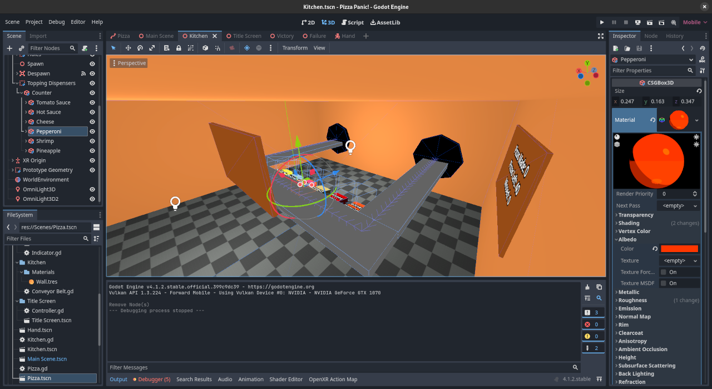

# Pizza Panic
Pizza Panic is a virtual-reality pizzamaking game inspired by the classic Club Penguin minigame Pizzatron 3000.

> [!NOTE]
> This project is currently in its early demo stage and is not a finished product.

## Credits
* **Original Concept:** RocketSnail Games, New Horizon Interactive
* **Godot Engine**: Juan Linietsky, Ariel Manzur
* **Developer**: Garrett Howard
